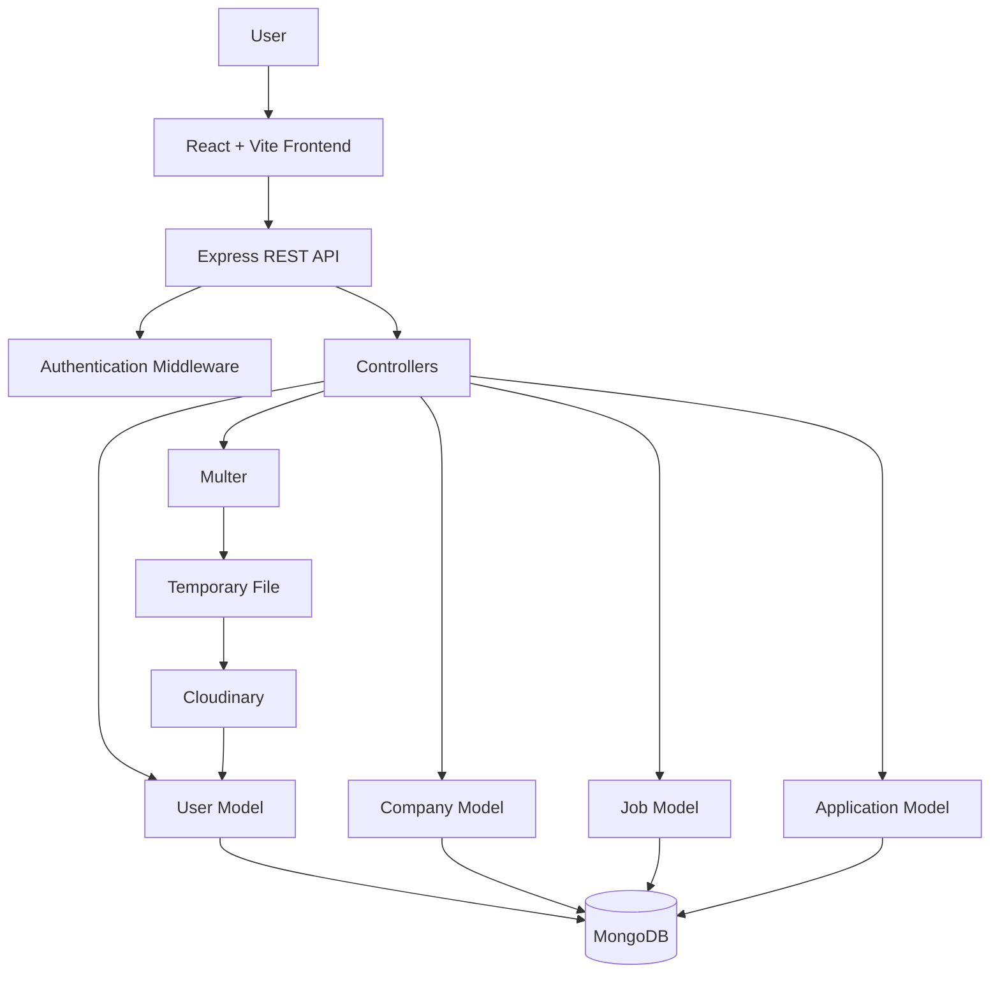

# Job-Hunt

> A full-stack job portal that connects job seekers with recruiters through job discovery, company management, applications, and profile management.

## Overview

Job-Hunt is a MERN-style web application built with React and Vite on the frontend and Express.js with MongoDB on the backend.

The application supports two user roles:

* **Student** — browse jobs, search for opportunities, view job details, apply for jobs, track applications, and manage a profile.
* **Recruiter** — create and manage companies, publish jobs, view jobs posted by the recruiter, and review/update job applications.

The backend exposes a REST API under `/api/v1` and separates routing, controllers, database models, authentication middleware, file-upload handling, and utility classes.

## Features

### Authentication

* User registration
* User login
* Student/recruiter role selection
* Password hashing with bcrypt
* JWT access-token generation
* JWT refresh-token generation
* Authentication through HTTP-only cookies
* Bearer-token authentication fallback
* Logout and refresh-token removal

### Job Discovery

* Browse available jobs
* Search jobs using a keyword
* Search matches against job titles and descriptions
* View individual job details
* View jobs created by the authenticated recruiter

### Job Management

Recruiters can:

* Create companies
* Create job postings
* Associate jobs with companies
* Specify job requirements
* Specify salary
* Specify experience level
* Specify location
* Specify job type
* Specify number of positions
* View jobs they have created

Supported job types:

* Full-time
* Part-time
* Contract
* Internship

### Applications

Students can:

* Apply to jobs
* Prevent duplicate applications to the same job
* View their submitted applications

Recruiters can:

* View applicants associated with a job
* Update application status

Supported application statuses:

* `pending`
* `accepted`
* `rejected`

### Profile Management

Users can update:

* Full name
* Email
* Phone number
* Bio
* Skills
* Resume

Skills submitted through the profile API are converted from a comma-separated string into an array.

### Resume Upload

Resume uploads are handled through:

1. Multer
2. Temporary local storage
3. Cloudinary
4. MongoDB user profile

The Cloudinary URL and original filename are stored in the user's profile.

## Tech Stack

### Frontend

| Technology            | Purpose                              |
| --------------------- | ------------------------------------ |
| React 19              | UI development                       |
| Vite 7                | Development server and build tooling |
| React Router DOM      | Client-side routing                  |
| Redux Toolkit         | Application state management         |
| React Redux           | React/Redux integration              |
| Axios                 | HTTP requests                        |
| Tailwind CSS 4        | Styling                              |
| Radix UI              | Accessible UI primitives             |
| Lucide React          | Icons                                |
| Embla Carousel        | Carousel functionality               |
| Sonner                | Toast notifications                  |
| clsx / tailwind-merge | Class-name composition               |

### Backend

| Technology    | Purpose                            |
| ------------- | ---------------------------------- |
| Node.js       | Runtime                            |
| Express 5     | REST API                           |
| MongoDB       | Database                           |
| Mongoose      | MongoDB ODM                        |
| JWT           | Authentication tokens              |
| bcrypt        | Password hashing                   |
| Multer        | Multipart/file uploads             |
| Cloudinary    | Resume storage                     |
| Cookie Parser | Cookie handling                    |
| CORS          | Cross-origin request configuration |
| dotenv        | Environment configuration          |
| Nodemon       | Backend development                |

The frontend dependencies and scripts are defined in `frontend/package.json`, while the backend dependencies and development script are defined in `backend/package.json`.

## Architecture



The Express application mounts the API under four route groups:

```text
/api/v1/users
/api/v1/company
/api/v1/jobs
/api/v1/applications
```

These routes are registered in `backend/src/app.js`.

## Data Flow

### User Authentication

```text
User
  │
  ▼
React Login/Register Form
  │
  ▼
POST /api/v1/users/login
  │
  ▼
User Controller
  │
  ├── Find user in MongoDB
  ├── Compare password using bcrypt
  ├── Verify requested role
  ├── Generate access token
  └── Generate refresh token
  │
  ▼
HTTP-only Cookies + Response
  │
  ▼
Authenticated Frontend
```

The login controller checks the supplied email, validates the password, verifies the requested role, generates both tokens, and sets the access and refresh tokens as cookies.

### Protected Requests

```text
Frontend
   │
   ▼
API Request
   │
   ├── accessToken Cookie
   │       OR
   └── Authorization: Bearer <token>
           │
           ▼
      jwtVerify Middleware
           │
           ▼
       JWT Verification
           │
           ▼
       Find User
           │
           ▼
        req.user
           │
           ▼
        Controller
```

The authentication middleware checks the cookie first and then falls back to the Authorization header.

### Job Application Flow

```text
Student
   │
   ▼
View Job
   │
   ▼
POST /api/v1/applications/apply/:id
   │
   ▼
Application Controller
   │
   ├── Check authenticated user
   ├── Check job ID
   ├── Check duplicate application
   ├── Verify job exists
   └── Create Application
          │
          ▼
      MongoDB
          │
          ▼
   Add application ID
   to Job.applications
```

The application controller explicitly checks for an existing application before creating a new one and then adds the created application's ID to the job document.

### Resume Upload Flow

```text
User
  │
  ▼
Profile Update
  │
  ▼
Multer
  │
  ▼
public/temp/
  │
  ▼
Cloudinary Upload
  │
  ├── secure_url
  └── original_filename
  │
  ▼
User.profile
  │
  └── MongoDB
```

Multer stores uploaded files temporarily and the Cloudinary utility uploads the file using `resource_type: "auto"` before removing the local temporary file.

## Project Structure

```text
Job-Hunt/
├── backend/
│   ├── src/
│   │   ├── controllers/
│   │   │   ├── application.controller.js
│   │   │   ├── company.controller.js
│   │   │   ├── job.controller.js
│   │   │   └── user.controller.js
│   │   │
│   │   ├── db/
│   │   │   └── index.js
│   │   │
│   │   ├── middlewares/
│   │   │   ├── auth.middleware.js
│   │   │   └── multer.middleware.js
│   │   │
│   │   ├── models/
│   │   │   ├── application.model.js
│   │   │   ├── company.model.js
│   │   │   ├── job.model.js
│   │   │   └── user.model.js
│   │   │
│   │   ├── routes/
│   │   │   ├── application.routes.js
│   │   │   ├── company.routes.js
│   │   │   ├── job.routes.js
│   │   │   ├── testCloudinary.js
│   │   │   └── user.routes.js
│   │   │
│   │   ├── utils/
│   │   │   ├── ApiError.js
│   │   │   ├── ApiResponse.js
│   │   │   ├── asyncHandler.js
│   │   │   └── cloudinary.js
│   │   │
│   │   ├── app.js
│   │   ├── constants.js
│   │   └── index.js
│   │
│   ├── .gitignore
│   ├── package.json
│   └── package-lock.json
│
├── frontend/
│   ├── public/
│   ├── src/
│   │   ├── assets/
│   │   ├── components/
│   │   │   ├── Shared/
│   │   │   │   ├── Footer.jsx
│   │   │   │   └── Navbar.jsx
│   │   │   │
│   │   │   ├── auth/
│   │   │   │   ├── Login.jsx
│   │   │   │   └── Signup.jsx
│   │   │   │
│   │   │   ├── ui/
│   │   │   ├── AppliedJobTable.jsx
│   │   │   ├── Browse.jsx
│   │   │   ├── CategoryCarousel.jsx
│   │   │   ├── FilterCard.jsx
│   │   │   ├── HeroSection.jsx
│   │   │   ├── Home.jsx
│   │   │   ├── Job.jsx
│   │   │   ├── JobDescription.jsx
│   │   │   ├── Jobs.jsx
│   │   │   ├── LatestJobCard.jsx
│   │   │   ├── LatestJobs.jsx
│   │   │   ├── Profile.jsx
│   │   │   └── UpdateProfileDialog.jsx
│   │   │
│   │   ├── lib/
│   │   │   └── utils.js
│   │   │
│   │   ├── redux/
│   │   │   ├── authSlice.js
│   │   │   └── store.js
│   │   │
│   │   ├── utils/
│   │   │   └── constant.js
│   │   │
│   │   ├── App.jsx
│   │   ├── App.css
│   │   ├── index.css
│   │   └── main.jsx
│   │
│   ├── components.json
│   ├── eslint.config.js
│   ├── index.html
│   ├── jsconfig.json
│   ├── package.json
│   ├── package-lock.json
│   └── vite.config.js
│
└── README.md
```

The backend and frontend directory structures are confirmed by the repository tree.

## Database Schema

### User

The `User` model contains:

* `fullName`
* `email`
* `phoneNumber`
* `password`
* `role`
* `profile.bio`
* `profile.skills`
* `profile.resume`
* `profile.resumeOriginalName`
* `profile.profilephoto`
* `profile.company`
* `refreshToken`
* timestamps

The role is restricted to:

```text
student
recruiter
```

The password is hashed with bcrypt before saving.

### Company

```text
Company
├── name
├── description
├── website
├── location
├── logo
├── userId → User
└── timestamps
```

### Job

```text
Job
├── title
├── description
├── requirements[]
├── salary
├── experienceLevel
├── location
├── jobType
├── position
├── company → Company
├── created_by → User
├── applications[] → Application
└── timestamps
```

### Application

```text
Application
├── job → Job
├── applicant → User
├── status
└── timestamps
```

The status is restricted to `pending`, `accepted`, or `rejected`.

## API Documentation

All API endpoints are mounted below:

```text
/api/v1
```

### User API

| Method | Endpoint                       | Purpose                    | Authentication |
| ------ | ------------------------------ | -------------------------- | -------------- |
| POST   | `/api/v1/users/register`       | Register a user            | No             |
| POST   | `/api/v1/users/login`          | Authenticate a user        | No             |
| POST   | `/api/v1/users/profile/update` | Update user profile/resume | Required       |
| POST   | `/api/v1/users/logout`         | Logout                     | Required       |

### Company API

| Method | Endpoint                     | Purpose                                              | Authentication |
| ------ | ---------------------------- | ---------------------------------------------------- | -------------- |
| POST   | `/api/v1/company/register`   | Register a company                                   | Required       |
| GET    | `/api/v1/company/get`        | Get companies associated with the authenticated user | Required       |
| GET    | `/api/v1/company/get/:id`    | Get company by ID                                    | Required       |
| PUT    | `/api/v1/company/update/:id` | Update company                                       | Required       |

### Job API

| Method | Endpoint               | Purpose                                | Authentication |
| ------ | ---------------------- | -------------------------------------- | -------------- |
| POST   | `/api/v1/jobs/post`    | Create a job                           | Required       |
| GET    | `/api/v1/jobs/get`     | Get/search jobs                        | Required       |
| GET    | `/api/v1/jobs/get/:id` | Get a job by ID                        | Required       |
| GET    | `/api/v1/jobs/admin`   | Get jobs created by authenticated user | Required       |

The job search endpoint accepts an optional `keyword` query parameter and performs case-insensitive regex matching against job title and description.

Example:

```text
GET /api/v1/jobs/get?keyword=react
```

### Application API

| Method | Endpoint                                 | Purpose                         | Authentication |
| ------ | ---------------------------------------- | ------------------------------- | -------------- |
| POST   | `/api/v1/applications/apply/:id`         | Apply for a job                 | Required       |
| GET    | `/api/v1/applications/get`               | Get current user's applications | Required       |
| GET    | `/api/v1/applications/:id/applicants`    | Get applicants for a job        | Required       |
| PUT    | `/api/v1/applications/status/:id/update` | Update application status       | Required       |

Example application-status request:

```json
{
  "status": "accepted"
}
```

Supported values are:

```text
pending
accepted
rejected
```

## Authentication

Authentication is implemented using JWT.

### Password Security

Passwords are hashed using bcrypt before being persisted. Password comparison is performed through the `isPasswordCorrect` method on the user model.

### Access Token

The access token contains:

```json
{
  "id": "user_id",
  "role": "student_or_recruiter"
}
```

The token expiration is controlled by the `ACCESS_TOKEN_EXPIRY` environment variable.

### Refresh Token

The refresh token contains the user ID and is stored in the user's MongoDB document.

### Protected Routes

The `jwtVerify` middleware:

1. Reads the access token from the cookie.
2. Falls back to the Authorization header.
3. Verifies the JWT.
4. Retrieves the corresponding user.
5. Removes password and refresh-token fields from the retrieved user.
6. Places the user on `req.user`.

## Environment Variables

The backend source code directly references the following environment variables:

```env
PORT=
CORS_ORIGIN=

MONGODB_URI=

ACCESS_TOKEN_SECRET=
ACCESS_TOKEN_EXPIRY=

REFRESH_TOKEN_SECRET=
REFRESH_TOKEN_EXPIRY=

CLOUDINARY_CLOUD_NAME=
CLOUDINARY_API_KEY=
CLOUDINARY_API_SECRET=
```

### Variable Purpose

| Variable                | Purpose                          |
| ----------------------- | -------------------------------- |
| `PORT`                  | Backend server port              |
| `CORS_ORIGIN`           | Allowed frontend origin          |
| `MONGODB_URI`           | MongoDB connection base URI      |
| `ACCESS_TOKEN_SECRET`   | JWT access-token signing secret  |
| `ACCESS_TOKEN_EXPIRY`   | Access-token expiration          |
| `REFRESH_TOKEN_SECRET`  | JWT refresh-token signing secret |
| `REFRESH_TOKEN_EXPIRY`  | Refresh-token expiration         |
| `CLOUDINARY_CLOUD_NAME` | Cloudinary account name          |
| `CLOUDINARY_API_KEY`    | Cloudinary API key               |
| `CLOUDINARY_API_SECRET` | Cloudinary API secret            |

The database name is defined in the repository as:

```text
job_hunt
```

and the backend connects using:

```text
MONGODB_URI/job_hunt
```

> Never commit `.env` files, API keys, JWT secrets, database credentials, or other private credentials to the repository.

## Installation

### Prerequisites

You need:

* Node.js
* npm
* A MongoDB deployment
* A Cloudinary account if resume uploads are required

### Clone

```bash
git clone https://github.com/Apratap01/Job-Hunt.git
cd Job-Hunt
```

### Backend

```bash
cd backend
npm install
```

Create the backend environment configuration using the variables listed above.

Start the development server:

```bash
npm run dev
```

The repository's backend development script runs:

```text
nodemon src/index.js
```

### Frontend

Open another terminal:

```bash
cd frontend
npm install
```

Start Vite:

```bash
npm run dev
```

The frontend also provides:

```bash
npm run build
npm run lint
npm run preview
```

## Frontend Routing

The React application currently defines these routes:

| Route              | Component        | Purpose      |
| ------------------ | ---------------- | ------------ |
| `/`                | `Home`           | Home page    |
| `/login`           | `Login`          | Login        |
| `/signup`          | `Signup`         | Registration |
| `/jobs`            | `Jobs`           | Job listing  |
| `/description/:id` | `JobDescription` | Job details  |
| `/browse`          | `Browse`         | Browse jobs  |
| `/profile`         | `Profile`        | User profile |

Redux is provided at the application root and a toaster is mounted globally.

## State Management

The frontend uses Redux Toolkit.

The repository contains:

```text
redux/
├── authSlice.js
└── store.js
```

The authentication slice maintains:

* `loading`
* `user`

and is registered through the Redux store.

## Error Handling

The backend defines reusable response classes:

### `ApiError`

Used to represent errors with:

* HTTP status code
* message
* success flag
* additional errors

### `ApiResponse`

Used for standardized successful responses containing:

* status
* data
* message
* success flag

### `asyncHandler`

Wraps asynchronous Express handlers and forwards rejected promises to Express's `next()` mechanism.

## File Upload and Storage

Multer is configured with disk storage:

```text
./public/temp/
```

The original filename is used when creating the temporary file.

Cloudinary is configured using:

```text
CLOUDINARY_CLOUD_NAME
CLOUDINARY_API_KEY
CLOUDINARY_API_SECRET
```

Uploaded files use Cloudinary's `resource_type: "auto"`.

## Testing

Automated application tests are **not currently included**.

The backend's current test script is a placeholder that exits with an error:

```bash
npm test
```

The frontend provides linting through:

```bash
npm run lint
```

and production build verification through:

```bash
npm run build
```

## Deployment

No deployment configuration was found that could be confidently documented as an implemented deployment target.

The repository does not provide verified configuration for:

* Vercel
* Netlify
* Render
* Railway
* AWS
* Docker
* Kubernetes
* GitHub Actions CI/CD

Therefore, no deployment URL or provider-specific deployment instructions are included here.

## Security Notes

The application implements several security-related mechanisms:

* bcrypt password hashing
* JWT authentication
* HTTP-only token cookies
* environment-based secrets
* CORS configuration
* authentication middleware
* removal of password and refresh-token fields from authenticated user queries

However, these mechanisms alone should not be interpreted as a guarantee that the application is production-secure.

Before production deployment, the authentication and authorization flows should be reviewed thoroughly.

In particular, role values exist in the user model and are checked during login, but the repository does not expose a separate role-authorization middleware layer.

## Engineering Notes

The project separates backend responsibilities into:

```text
Routes
   ↓
Middleware
   ↓
Controllers
   ↓
Models
   ↓
MongoDB
```

This separation keeps HTTP routing, authentication, business operations, and persistence logic in different modules.

The frontend similarly separates:

* Authentication components
* Shared UI
* Job-related components
* Profile functionality
* Redux state
* Reusable UI primitives
* Utility functions

The backend also centralizes common API errors, responses, async handling, and Cloudinary functionality.

## Potential Improvements

The following are improvements suggested from the current implementation, not existing features:

* Add automated unit and integration tests.
* Add explicit role-based authorization middleware.
* Add request validation for API payloads.
* Add pagination to job and application queries.
* Add database indexes for frequently searched fields.
* Improve duplicate/ownership authorization checks for company and application operations.
* Add centralized Express error-handling middleware if required by the application's error flow.
* Add production deployment configuration.
* Add CI/CD workflows.
* Add API documentation using OpenAPI/Swagger.
* Add rate limiting to authentication endpoints.
* Add stronger file-upload validation and size/type restrictions.
* Resolve the `mongoose` versus `moongose` dependency discrepancy in `backend/package.json`.
* Add a root-level `.env.example` or backend-specific example configuration.
* Add screenshots or a live demo once a verified deployment is available.

## License

The backend `package.json` currently specifies the `ISC` license. A repository-wide license should be confirmed and, if intended, represented by a root-level `LICENSE` file.

## Repository

[GitHub Repository](https://github.com/Apratap01/Job-Hunt)
